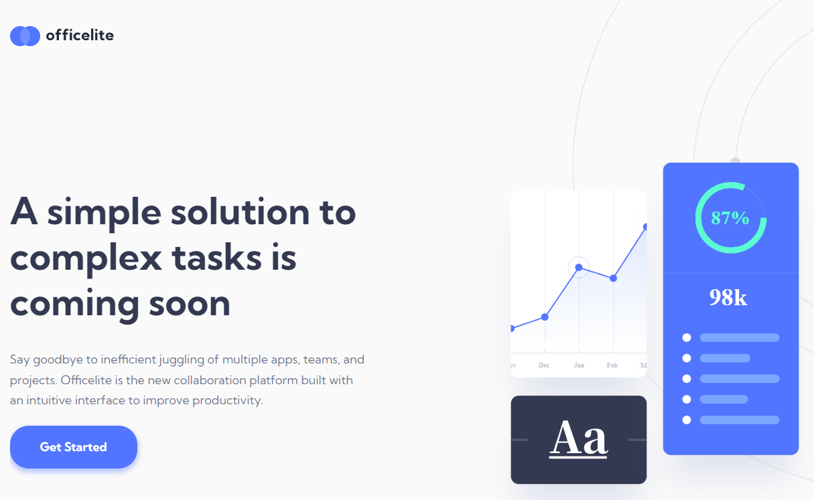

# Frontend Mentor - officelite website solution

This is a solution to the [Officelite website challenge on Frontend Mentor](https://elaborate-dragon-0e7077.netlify.app/). Frontend Mentor challenges help you improve your coding skills by building realistic projects. 

## Overview
Despite the challenge being labelled as a 'Junior' challenge I found that the layout proved fairly challening to build and change for different devices. Making a background pattern on the wrapper of the site to give the illusion that there is an element that looks like a footer is something that I haven't done before.

### The challenge

Users should be able to:

- View the optimal layout for the site depending on their device's screen size
- See hover states for all interactive elements on the page
- See error states when the contact form is submitted if:
  - The `Name` and/or `Email Address` fields are empty
  - The `Email Address` is not formatted correctly
- **Bonus**: See a live countdown timer that ticks down every second
- **Bonus**: See a custom-styled `select` form control in the sign-up form

### Screenshot



### Links

- [Live site](https://bengera.github.io/myteam/)

### Built with

- Semantic HTML5 markup
- SCSS/CSS
- Flexbox
- Mobile-first workflow
- Vanilla JavaScript


### What I learned
Background pattern makes a solid blue color at the bottom of the layout.

```scss
.wrap {
  position: relative;
  background: linear-gradient(to bottom, #FAFAFA 55%, #25293A 55%);
  z-index: 0;
  overflow: hidden;

  @include mq(medium) {
    background: linear-gradient(to bottom, #FAFAFA 57%, #25293A 57%);
      }

      @include mq(large) {
        background: linear-gradient(to bottom, #FAFAFA 65%, #25293A 65%);
      }
}
```
notes here
I added this small bit of code to change the size of the day box when there are three or more digits so the numbers don't flow out of the box.
```js
if (days.toString().length >= 3){
    countdownBoxDays.style.width = "130px";
}
     

```